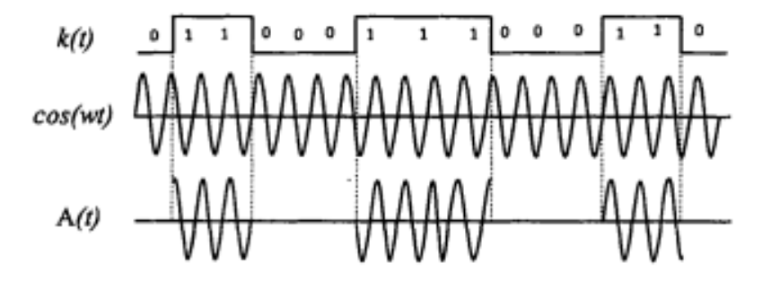
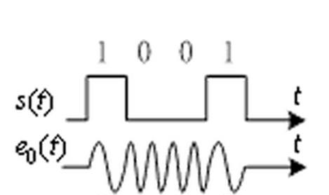
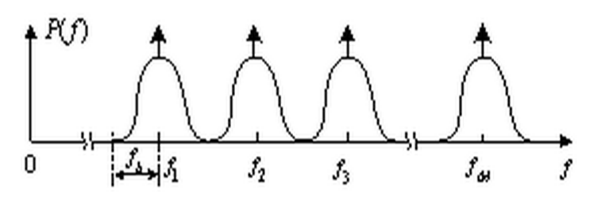
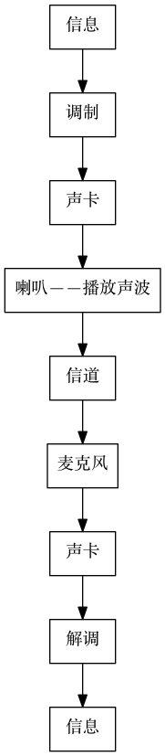

声波信息调制传输实验系统  

摘要  

随着移动互联网络的快速发展，移动设备之间快捷地进行信息交互成为了一个越来越重要的需求，因此，近距离无线通信技术应运而生。不过，传统的利用非接触式射频识别（RFID）的 NFC 技术由于需要在已有的移动设备上加入相应的硬件电路，所以还存在一定的推广上的困难。而本文使用 Labview 软件完成了一个通过线性压缩扩频调制技术把信息编码在声波中，从而进行通信的系统，验证了使用 多进制数字频率调制技术进行声波调制的可行性。这种通信方式具有不需要对现有的移动设备进行硬件改造，只需要利用已有的麦克风和扬声器即可实现近距离无线通信功能的优点。在最后本文通过实验，验证了这种调制方式的可行性。  
关键字：声波， 多进制数字频率调制（MFSK）， 二进制数字频率调制（2FSK）， 二进制数字振幅调制（2ASK）， 扬声器， 麦克风， Labview

#研究背景  
##近距离无线通信  
随着移动互联网络的快速发展，移动设备之间快捷地进行信息交互成为了一个越来越重要的需求，因此，近距离无线通信技术应运而生。而近距离无线通信的应用领域非常广：  

+  点到点，将近距离无线通信用于启动两个装置之间的通信。  
+  付款和票务，将近距离无线通信搭建在新兴的智能票务和电子付款基础设施之上。  
+  服务的启动，将近距离无线通信用于实现服务发现和“开启”另一种服务(例如为数据传输开启另一条通信链接)。  

##NFC技术  
传统的利用非接触式射频识别（RFID）的 NFC 技术由于需要在已有的移动设备上加入专门的无线处理的硬件电路或者选用已有的芯片，市场上存在的设备如果不具备这个硬件就不可以的和其他的设备进行通信，所以这个技术想要的进行推广只能靠各个厂商制定一个统一的标准并且在新推出的设备上安装相应的硬件设施。而由于有很多市场上的原因，不同设备厂商之间的通信会存在各种各样的壁垒，比如新推出的 iphone6 上的 NFC 功能就只支持苹果公司的 Apple Pay 功能，所以基于 NFC 这个无线通信技术的推广上还存在一定的困难。  
我国首个手机NFC实际使用开始于2006年6月，当时由诺基亚和中国移动、飞利浦、易通卡公司在厦门试点NFC手机支付。用户使用内嵌NFC模块的诺基亚3220手机，可在厦门市任何一个易通卡覆盖的营业网点(公交汽车、轮渡、电影院、快餐店)进行手机支付。如今在北京以及大部分的一线城市，用户都可以使用指定的NFC手机实现刷手机来乘坐公交地铁，一些城市甚至还支持在超市餐饮，以及其他一些小额消费的支付方面进行交易。

##声波通信  
无线通信中，除了以电磁波作为通信信号的载体，利用某一些载体，比如空气、金属作为通道，通过声波也可以进行通信。声波通信系统中的信道是声音信道即传播的是声波，而无线电通信系统信道中传播的是无线电波。声波通信系统中的发射接收装置是换能器 ，而无线电通信系统中的发射接收装置是天线。  
系统中的信源将消息转化为电信号，信源编码将原始模拟信息通过量化编码变成数字码组，提高了数字信号传输的有效性；然后通过信道编码使系统具有一定的检错纠错能力；之后经过载波调制后向接收端发送信息。  
而声波是人类比较早使用的一种信息载体，而且也是所有多媒体设备都必须带有的基础设施，所以如果能够利用声波进行通信，那么所有的带有多媒体功能的像手机这样的移动设备就可以不需要经过硬件上的更新或者改动，就可以多一个近距离通信的通道，从而实现之前所描述的近距离无线通信的功能。  

#声波通信实验系统设计  
本文使用的通信系统载波是声波，但是使用的都是通信系统设计中成熟的调制解调还有编码的方式。接下来的本章会描述这个基于声波的通信系统的设计过程，以及用到的相关理论的原理。  

##二进制数字振幅调制（2ASK）  
振幅键控(Amplitude Shift Keying，ASK)，是通过控制载波振幅的变化来传递信息，其中，二进制数字振幅键控通常表示为2ASK。二进制数字振幅调制中，一个连续的正弦载波信号受控制代表数据信息的“0”和“1”的基带矩形脉冲，当基带信号为“1”时输出端输出正弦载波，当基带信号为“0”时输出端无载波输出。根据线性调制原理，二进制数字振幅调制信号可表示为一个单极性二进制信号与一个正弦载波相乘，其表达式如下所示：  
$$A(t) = [\sum_n^{ } a_ng(t-nT)cos(\omega t)]$$  
式中，$g(t-nT)$表示为持续时间为T的矩形脉冲，$\omega$为载波频率，$a_n$代表二进制数值“0”或“1”。若另  
$$k(t)=\sum_{n}^{ } a_ng(t-nT)$$  

则$A(t)$可以表示为  
$$A(t)=k(t) * cos(\omega t)$$  

##二进制数字频率调制（2FSK）  
数字频率调制又称频移键控（FSK），二进制频移键控记作2FSK。数字频移键控是用载波的频率来传送数字消息，即用所传送的数字消息控制载波的频率。2FSK信号便是符号“1”对应于载频，而符号“0”对应于载频（与不同的另一载频）的已调波形，而且与之间的改变是瞬间完成的。
从原理上讲，数字调频可用模拟调频法来实现，也可用键控法来实现。模拟调频法是利用一个矩形脉冲序列对一个载波进行调频，是频移键控通信方式早期采用的实现方法。2FSK键控法则是利用受矩形脉冲序列控制的开关电路对两个不同的独立频率源进行选通。键控法的特点是转换速度快、波形好、稳定度高且易于实现，故应用广泛。
2FSK 调制的波形如下式所示  

$$e_0=s(t)cos(\omega_1t + \varphi_n) + \overline{s(t)}cos(\omega_2t+\theta_n)$$

上式中，$s(t)$为需要调制的信息的信号。

波形如下图所示：  

##多进制数字频率调制（MFSK）
多进制数字频率调制（MFSK）简称多频制，是2FSK方式的推广。它是用 M 个不同的载波频率代表 M 种数字信息。键控法产生的MFSK信号，可以看作由个幅度相同、载频不同、时间上互不重叠的2ASK信号叠加的结果。设MFSK信号码元的宽度为$Tb$，即传输速率$f_b=1/T_b$（Baud），则 M 频制信号的带宽为  

$$B_{MFSK} = f_M-f_1+2f_b$$

式中$f_M$为最高选用载频，$f_1$为最低选用载频。  
下图为MFSK在频域中的示意图：  

##调制方式选择  
以上提到的是几个比较常用的调制方式。其中由于多进制数字已调信号的被调参数在一个码元间隔内有多个取值，因此，与二进制数字调制相比，多进制数字调制有以下几个特点：  

+  在码元速率（传码率）相同条件下，可以提高信息速率（传信率），使系统频带利用率增大。码元速率相同时，进制数传系统的信息速率是二进制的倍。在实际应用中，通常取，为大于1的正整数。  
+  在信息速率相同条件下，可以降低码元速率，以提高传输的可靠性。信息速率相同时，进制的码元宽度是二进制的倍，这样可以增加每个码元的能量，并能减小码间串扰影响等。  

而由于本文中的声波通信由于是用在近距离无线通信方面，所以使用的场景对使用的频点没有特殊的要求。而手机这样的移动设备的声波的采样率不会太高，一般为 $44.1kHz$，根据奈奎斯特－香农采样定理，最高的信号频率，也就是奈奎斯特频率一般为 $22.05kHz$ 刚好在人耳可以听到的极限附近。也就是说，调制的信号的频率范围和人耳可以听到的频率范围有大部分的重合。  

也就是说能使用的载波的带宽有限，为了提高频带的利用率[[@RefWorks:21]]，并且考虑到实现的难度，我们选用了多进制数字频率调制。

##协议设计  
由于使用了多进制数字频率调制的方式，所以在编码的设计上就可以直接使用一些特殊的频点来进行只需要单个周期的同步操作，其余的频点还是继续作为多进制的数据位来进行信号的传输。由于多进制最后也需要拼接为以字节，也就是8位的二进制数来表达的数据，所以使用的数据段的位数应该要是8的一个约数。而本文考虑到兼顾频带的利用率和实现的难度，最终选定了使用$2^4=16$来作为数据段频点的数量。  

而同步和起停的信号的设计，则是使用其余的频点。最终，所使用的频点有19个，分别是$2^4=16$个传输数据的频点，一个同步用的频点，两个分别作为数据开始、结束传输标志的频点。

#声波通信实验系统实现  
由于这里是做出一个可以验证这个声波通信系统的原型实验，所以本文选择了简单易用、功能强大的 Labview 作为实验系统开发的平台。  

##Labview  
LabVIEW是一种基于G语言的图形化虚拟仪器开发工具，主要用于数据的采集、分析、处理和表达，总线接口、VXI仪器以及GPIB与串13仪器的驱动程序编制和虚拟仪器驱动。与传统编程语言最大的区别是，LabVIEW使用图形语言(即各种图标、图形符号、连线等)，以框图的形式编写程序，一个LabVIEW程序包括：前面板、框图程序、图标／接线端口。前面板是交互式图形化用户界面，用于设置输入数值和观察输出量；框图程序是利用图形语言对前面板的控制量和指示量进行控制，图标／接线端口用于把LabVIEW程序定义成一个子程序，以便在其他程序中加以调用[[@RefWorks:19]]。  

LabVIEW中提供了一系列使用Windows底层函数编写的笔记本电脑声卡VIs，这些函数使用Windows底层函数直接与笔记本电脑声卡驱动打交道，封装层次低、速度快，而且可以访问、采集缓冲区任意位置的数据，具有很大的灵活性，能够满足实时不间断采集的需要，同时LabVIEW提供了相应的信号分析模块，可轻松实现信号的各种分析和处理[[@RefWorks:20]]。  

##数字信号处理（DSP）  
对于通信系统，里面有很多的部分都需要进行使用模拟电路的对信号进行计算、处理，比如滤波、调制或者解调。而相比起传统的使用模拟电路进行信号的处理，数字信号处理技术及设备具有灵活、精确、抗干扰强、设备尺寸小、造价低、速度快等突出优点，这些都是模拟信号处理技术与设备所无法比拟的。  

数字信号处理通常通过傅里叶变换从时域或者空间域转换到频域。傅里叶变换将信号信息转换成每个成分频率上的幅度和相位。傅里叶变换经常转换成功率谱，功率谱是每个成分频率幅度的平方。在频域分析信号的最常见目的是分析信号属性。只需要通过分析频谱，就可以了解到信号在频域上的属性，甚至可以把一些操作直接应用在频域，从而轻易地完成一些所需要数字信号的操作，比如直接改变或者观察某些频点的幅度即可代替传统的模拟电路完成对载波的调制或者解调。

而本文也使用了 Labview 这个平台，实现了一个典型的 DSP 系统，就是只通过声卡进行模拟到数字（麦克风采集声波信号）和数字到模拟（使用扬声器播放声波信号）的信号的转换，中间的调制、解调还有数据的分析全部使用软件算法完成。从而使整个系统的构建更加灵活、快捷、简单，信号的处理也更加精确。  

##编程实现  
系统的主要组成如下图所示  

系统可以分为发送端和接收端,发送端实现信源数据接收和调制功能,接收端则实现信号接收和解调功能。上图中，使用 Labview 完成的部分主要是信号的调制、解调，以及驱动声卡通过扬声器进行声波的播放和通过麦克风接收声波的信号。  

而多进制数字频率调制的实现则是直接使用 DSP 的方式。在调制的部分，根据当前需要调制的信号直接选择需要的频率生成一定时长的正弦波然后输出。而调制的地方则是通过 FFT ，把采集回来的信号转换到频域，然后把预选好的19个频点单独提取出来，通过查看幅值的大小来判断是否有有效的信号来了。  

而协议上，则是使用一个特定的频点作为每一位（单独一个时间里的频点）数据传输的同步位，也就是每一位数据在进行传输的之前都会有这个频点作为开头。然后一个帧的开头和结尾则是使用另外的两个不同的频点在标记。总的来说，也就是使用三个位的信号来进行握手。

#结论  

本文先是给出了一些通信领域的经典的调制方式，并且在经过对比之后选用了多进制数字频率调制（MFSK）的调制技术，并且运用在了声波通信上。并且基于 Labview 的开发平台，使用 DSP 技术，使用软件的方式完成信号的发送、接收、调制和解调各个部分的实现。  

#引用文献  
